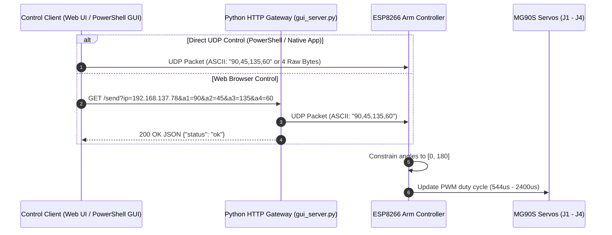

# ESP8266 4-DOF Robotic Arm — Data Communication Documentation

## 1. Network & Transport Configuration

- **Protocol**: UDP (User Datagram Protocol)
- **Transport Mode**: Connectionless / Low-latency Realtime Control
- **Port**: `8888`
- **Wi-Fi Mode**: Station (`WIFI_STA`)
- **Default Network Credentials**:
  - **SSID**: `configurator`
  - **Password**: `tolakangin`

---

## 2. Hardware Joint & Servo Mapping

The ESP8266 controls 4 MG90S Micro Servos attached to specific GPIO pins:

| Servo | GPIO Pin | Joint Name | Movement / Axis | Valid Angle Range | Default Angle |
| :--- | :--- | :--- | :--- | :--- | :--- |
| **Servo 1** | `GPIO 1` (TX) | **Elbow Pitch** (`J3`) | Elbow joint up/down angle | `0°` – `180°` | `90°` |
| **Servo 2** | `GPIO 3` (RX) | **Shoulder Pitch** (`J2`) | Arm shoulder up/down angle | `0°` – `180°` | `90°` |
| **Servo 3** | `GPIO 5` | **Base Yaw** (`J1`) | Arm base rotation left/right | `0°` – `180°` | `90°` |
| **Servo 4** | `GPIO 4` | **Wrist Pitch** (`J4`) | End-effector / wrist angle | `0°` – `180°` | `90°` |

> [!NOTE]
> `GPIO 1` and `GPIO 3` share hardware RX/TX pins on the ESP8266. Serial debugging (`Serial.begin`) is deliberately disabled in firmware to prevent serial data from corrupting servo PWM control signals.

---

## 3. Data Communication Payload Formats

The ESP8266 firmware accepts **two** data communication modes over UDP port `8888`:

### Mode A: ASCII Text String (Recommended for Human-Readable Control)

The microcontroller parses string payloads formatted as comma-separated (`,`) or space-separated (` `) integers representing target angles in degrees.

#### 4-Joint Format:
$$\text{Payload} = \text{"<Angle1>,<Angle2>,<Angle3>,<Angle4>"}$$

- **Example**: `"90,45,135,60"`
  - `Servo 1` (GPIO 1 / Elbow Pitch J3): `90°`
  - `Servo 2` (GPIO 3 / Shoulder Pitch J2): `45°`
  - `Servo 3` (GPIO 5 / Base Yaw J1): `135°`
  - `Servo 4` (GPIO 4 / Wrist Pitch J4): `60°`

#### 3-Joint Format (Fallback):
$$\text{Payload} = \text{"<Angle1>,<Angle2>,<Angle3>"}$$
- **Behavior**: Sets Servos 1, 2, and 3; Servo 4 defaults to `90°`.

---

### Mode B: Raw Binary Bytes (Optimized High-Speed Control)

For minimal transport overhead and maximum throughput, send raw unsigned 8-bit bytes (`uint8_t`).

#### 4-Byte Payload Structure:

| Byte Index | Data Type | Field | Description |
| :---: | :---: | :--- | :--- |
| `[0]` | `uint8_t` | Servo 1 | Elbow Pitch (`J3`) angle (`0` – `180`) |
| `[1]` | `uint8_t` | Servo 2 | Shoulder Pitch (`J2`) angle (`0` – `180`) |
| `[2]` | `uint8_t` | Servo 3 | Base Yaw (`J1`) angle (`0` – `180`) |
| `[3]` | `uint8_t` | Servo 4 | Wrist Pitch (`J4`) angle (`0` – `180`) |

- **Payload Size**: Exactly `4 bytes` (or `3 bytes` where `Byte[3]` defaults to `90`).
- **Example Packet** (Hex): `5A 2D 87 3C`
  - `0x5A` = `90` (Elbow Pitch)
  - `0x2D` = `45` (Shoulder Pitch)
  - `0x87` = `135` (Base Yaw)
  - `0x3C` = `60` (Wrist Pitch)

---

## 4. Web GUI REST API Bridge (`gui_server.py`)

The local Python Web Server acts as an HTTP-to-UDP control gateway.

### Send Angles Endpoint
- **URL Path**: `/send`
- **HTTP Method**: `GET`
- **Query Parameters**:
  - `ip`: ESP8266 target IP address (e.g. `192.168.137.78`)
  - `a1`: Servo 1 angle (`0` – `180`)
  - `a2`: Servo 2 angle (`0` – `180`)
  - `a3`: Servo 3 angle (`0` – `180`)
  - `a4`: Servo 4 angle (`0` – `180`)

- **Example HTTP Request**:
  ```http
  GET /send?ip=192.168.137.78&a1=90&a2=45&a3=135&a4=60 HTTP/1.1
  Host: localhost:8000
  ```

- **HTTP JSON Response**:
  ```json
  {
    "status": "ok",
    "ip": "192.168.137.78",
    "port": 8888,
    "a1": 90,
    "a2": 45,
    "a3": 135,
    "a4": 60
  }
  ```

---

## 5. Control Sequence Diagram


